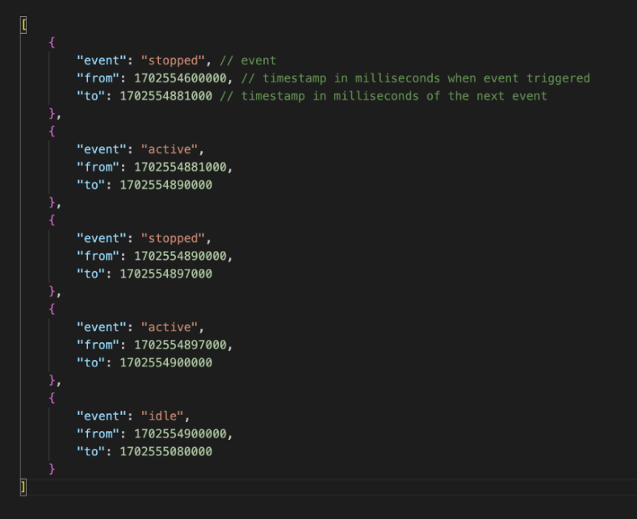

# vehicle-challenge

Quick fun coding challenge!

## Quick start

install dependencies

```bash
npm install
```

run API server

```bash
npm dev
```

run tests

```bash
npm test
```

make a post from the CLI

```bash
curl -X POST \
  -d '{"startDate":"2023-12-13T00:02:00Z", "endDate":"2023-12-14T17:59:51Z","vehicleId":"sprint-3"}' \
  -H "Content-Type: application/json" \
  "http://localhost:3000/search"
```

## The Challenge

### Scope

Load [sample data]((https://docs.google.com/spreadsheets/u/0/d/1dmI7ExyN-OzkmmuFO5jqAoq7QV0hGFTa0Ew6of2LxqU/edit)) into DB of your choice. Create an API method written in node.js that accepts interval boundaries and vehicle id as parameters and transforms sample data into a sequence of intervals in JSON format that will be later output on a timeline by frontend. Each bar on the graph represents a period of time when a vehicle was in certain status:

### Input parameters

* startDate - date&time in UTC
* endDate - date&time in UTC
* vehicleId - given Vehicle ID

### Example Response



### Requirements:
* Response must contain at least 1 interval
* ‘from’ key of the first interval in the resulting array must be equal to the startDate input param
* ‘to’ key of the last interval in the resulting array must  be equal to the endDate input param
* Consecutive similar events must be combined into one interval
* First interval in the response must contain ‘event’ value of the latest event before the startDate
* If there’s no logged events before the startDate, first interval must contain ‘no_data’ in the ‘event’ field

### Edge cases:
* There are no events within the [startDate;endDate] interval
* There is only one event within the [startDate;endDate] interval
* All events within the [startDate;endDate] interval have the same type
* There are no logged events before the startDate
* First event’s timestamp within the [startDate;endDate] interval equals startDate
* Last event’s timestamp within the [startDate;endDate] interval equals endDate

### Error handling:
* Suggest your own error handling
* Cases that must me handled:
* startDate > endDate
* Bad format of startDate / end Date

## Folder structure

```
challenge
+--src/                       * source for search API
+--test/                      * test files
+--CMD.md                     * sample cli command
*--README.md                  * this file
*--sample_data.csv            * the original csv file
*--vehicle_events_data.json   * the converted json used as a dummy DB
```